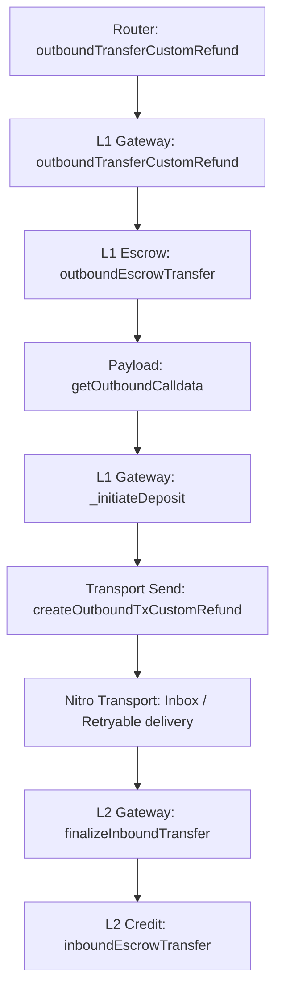

# Deposit Review

## Flow



`Inbox / Retryable delivery` здесь отмечен только как transport segment полного deposit path. Nitro message-delivery internals не входят в мой текущий review scope.

## 1. L1GatewayRouter.outboundTransferCustomRefund(...)

```solidity
function outboundTransferCustomRefund(
    address _token,
    address _refundTo,
    address _to,
    uint256 _amount,
    uint256 _maxGas,
    uint256 _gasPriceBid,
    bytes calldata _data
) public payable override returns (bytes memory) {
    address gateway = getGateway(_token);
    bytes memory gatewayData = GatewayMessageHandler.encodeFromRouterToGateway(
        msg.sender,
        _data
    );

    emit TransferRouted(_token, msg.sender, _to, gateway);
    return
        IL1ArbitrumGateway(gateway).outboundTransferCustomRefund{ value: msg.value }(
            _token,
            _refundTo,
            _to,
            _amount,
            _maxGas,
            _gasPriceBid,
            gatewayData
        );
}
```

Что делает:

- выбирает gateway для `_token`
- сохраняет router-origin semantics
- передает deposit в нужный L1 gateway

Invariants:

- deposit path на уровне router должен идти в gateway, который выбрал routing surface
- router-origin semantics должны сохраняться при переходе в gateway layer

## 2. L1ArbitrumGateway.outboundTransferCustomRefund(...)

```solidity
function outboundTransferCustomRefund(
    address _l1Token,
    address _refundTo,
    address _to,
    uint256 _amount,
    uint256 _maxGas,
    uint256 _gasPriceBid,
    bytes calldata _data
) public payable virtual override returns (bytes memory res) {
    require(isRouter(msg.sender), "NOT_FROM_ROUTER");
    address _from;
    uint256 seqNum;
    bytes memory extraData;
    {
        uint256 _maxSubmissionCost;
        uint256 tokenTotalFeeAmount;
        if (super.isRouter(msg.sender)) {
            (_from, extraData) = GatewayMessageHandler.parseFromRouterToGateway(_data);
        } else {
            _from = msg.sender;
            extraData = _data;
        }
        (_maxSubmissionCost, extraData, tokenTotalFeeAmount) = _parseUserEncodedData(extraData);

        require(extraData.length == 0, "EXTRA_DATA_DISABLED");

        require(_l1Token.isContract(), "L1_NOT_CONTRACT");
        address l2Token = calculateL2TokenAddress(_l1Token);
        require(l2Token != address(0), "NO_L2_TOKEN_SET");

        _amount = outboundEscrowTransfer(_l1Token, _from, _amount);

        res = getOutboundCalldata(_l1Token, _from, _to, _amount, extraData);

        seqNum = _initiateDeposit(
            _refundTo,
            _from,
            _amount,
            _maxGas,
            _gasPriceBid,
            _maxSubmissionCost,
            tokenTotalFeeAmount,
            res
        );
    }
    emit DepositInitiated(_l1Token, _from, _to, seqNum, _amount);
    return abi.encode(seqNum);
}
```

Что делает:

- принимает routed deposit
- определяет реального `_from`
- парсит user-encoded data
- валидирует L1 token и настроенную L2 representation
- делает escrow
- строит outbound payload
- инициирует L1 -> L2 deposit message

Invariants:

- gateway-level deposit path должен вызываться только через router
- source-side accounting должен завершиться до payload construction и deposit initiation
- deposit path не должен строиться по невалидному L1 token или без настроенной L2 representation
- функция должна возвращать текущий deposit sequence number

## 3. L1ArbitrumGateway.outboundEscrowTransfer(...)

```solidity
function outboundEscrowTransfer(
    address _l1Token,
    address _from,
    uint256 _amount
) internal virtual returns (uint256 amountReceived) {
    uint256 prevBalance = IERC20(_l1Token).balanceOf(address(this));
    IERC20(_l1Token).safeTransferFrom(_from, address(this), _amount);
    uint256 postBalance = IERC20(_l1Token).balanceOf(address(this));
    return postBalance - prevBalance;
}
```

Что делает:

- переводит L1 token в escrow на gateway
- считает фактически полученный amount

Invariants:

- source-side accounting должен забирать актив именно с `_from` на gateway contract
- дальше по flow должен идти фактически полученный amount, а не просто номинальный `_amount`

## 4. L1ArbitrumGateway.getOutboundCalldata(...)

```solidity
function getOutboundCalldata(
    address _l1Token,
    address _from,
    address _to,
    uint256 _amount,
    bytes memory _data
) public view virtual override returns (bytes memory outboundCalldata) {
    bytes memory emptyBytes = "";

    outboundCalldata = abi.encodeWithSelector(
        ITokenGateway.finalizeInboundTransfer.selector,
        _l1Token,
        _from,
        _to,
        _amount,
        GatewayMessageHandler.encodeToL2GatewayMsg(emptyBytes, _data)
    );

    return outboundCalldata;
}
```

Что делает:

- строит payload для destination-side L2 finalize
- сохраняет `_l1Token / _from / _to / _amount`

Invariants:

- outbound payload должен target'ить именно `finalizeInboundTransfer`
- payload должен сохранять token, sender, recipient и amount deposit path

## 5. L1ArbitrumGateway._initiateDeposit(...)

```solidity
function _initiateDeposit(
    address _refundTo,
    address _from,
    uint256 _amount,
    uint256 _maxGas,
    uint256 _gasPriceBid,
    uint256 _maxSubmissionCost,
    uint256,
    bytes memory _data
) internal virtual returns (uint256) {
    return
        createOutboundTxCustomRefund(
            _refundTo,
            _from,
            _amount,
            _maxGas,
            _gasPriceBid,
            _maxSubmissionCost,
            _data
        );
}
```

Что делает:

- передает уже подготовленные deposit semantics в transport-facing creation step

Invariants:

- transport-facing deposit creation должен использовать уже готовое outbound calldata и не менять его смысл

## 6. L1ArbitrumGateway.createOutboundTxCustomRefund(...)

```solidity
function createOutboundTxCustomRefund(
    address _refundTo,
    address _from,
    uint256,
    uint256 _maxGas,
    uint256 _gasPriceBid,
    uint256 _maxSubmissionCost,
    bytes memory _outboundCalldata
) internal virtual returns (uint256) {
    return
        sendTxToL2CustomRefund(
            inbox,
            counterpartGateway,
            _refundTo,
            _from,
            msg.value,
            0,
            L2GasParams({
                _maxSubmissionCost: _maxSubmissionCost,
                _maxGas: _maxGas,
                _gasPriceBid: _gasPriceBid
            }),
            _outboundCalldata
        );
}
```

Что делает:

- переводит подготовленный deposit payload в retryable creation на transport layer
- форвардит `msg.value` как funding для inbox path
- target'ит `counterpartGateway`

Invariants:

- transport-facing deposit path должен target'ить именно `counterpartGateway`
- callvalue semantics должны оставаться согласованными между gateway layer и inbox funding layer

## 7. L2ArbitrumGateway.finalizeInboundTransfer(...)

```solidity
function finalizeInboundTransfer(
    address _token,
    address _from,
    address _to,
    uint256 _amount,
    bytes calldata _data
) external payable override onlyCounterpartGateway {
    (bytes memory gatewayData, bytes memory callHookData) = GatewayMessageHandler
        .parseFromL1GatewayMsg(_data);

    if (callHookData.length != 0) {
        callHookData = bytes("");
    }

    address expectedAddress = calculateL2TokenAddress(_token);

    if (!expectedAddress.isContract()) {
        bool shouldHalt = handleNoContract(
            _token,
            expectedAddress,
            _from,
            _to,
            _amount,
            gatewayData
        );
        if (shouldHalt) return;
    }

    bool shouldWithdraw = !_isValidTokenAddress(_token, expectedAddress);
    if (shouldWithdraw) {
        triggerWithdrawal(_token, address(this), _from, _amount, "");
        return;
    }

    inboundEscrowTransfer(expectedAddress, _to, _amount);
    emit DepositFinalized(_token, _from, _to, _amount);

    return;
}
```

Что делает:

- принимает counterpart-gated L1 -> L2 finalize call
- парсит payload
- определяет expected L2 token
- обрабатывает no-contract branch
- обрабатывает invalid-mapping fallback branch
- на normal branch делает final L2 credit

Invariants:

- destination-side finalize path должен оставаться counterpart-gated
- missing-contract branch не должен тихо продолжать normal mint path
- invalid L1/L2 token correspondence не должна заканчиваться normal credit branch
- final L2 credit должен происходить только по validated expected token path

## 8. L2ArbitrumGateway.inboundEscrowTransfer(...)

```solidity
function inboundEscrowTransfer(
    address _l2Address,
    address _dest,
    uint256 _amount
) internal virtual {
    IArbToken(_l2Address).bridgeMint(_dest, _amount);
}
```

Что делает:

- делает final L2 credit через mint соответствующего L2 token

Invariants:

- final L2 credit должен использовать validated expected token address
- final credit должен идти в `_dest` на `_amount`
