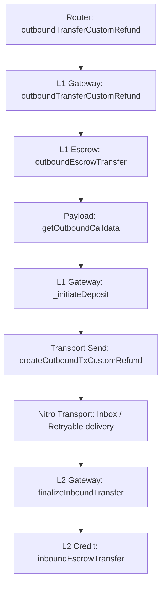

# Deposit Review

## Flow

`Inbox / Retryable delivery` здесь отмечен только как transport segment полного deposit path. Nitro message-delivery internals не входят в мой текущий review scope.

## 1. L1GatewayRouter.outboundTransferCustomRefund(...)

Что делает:

- выбирает gateway для `_token`
- упаковывает router-origin semantics
- передает deposit в соответствующий L1 gateway

Invariants:

- router-level deposit path должен направляться в gateway, выбранный routing surface
- router-origin semantics должны сохраняться при переходе в gateway layer

## 2. L1ArbitrumGateway.outboundTransferCustomRefund(...)

Что делает:

- принимает routed deposit
- определяет реального `_from`
- парсит user-encoded data
- валидирует L1 token и configured L2 representation
- выполняет escrow
- строит outbound payload
- инициирует L1 -> L2 deposit message

Invariants:

- gateway-level deposit path должен вызываться только через router
- source-side accounting должен завершиться до payload construction и deposit initiation
- deposit path не должен строиться по невалидному L1 token или без configured L2 representation
- наружу должен возвращаться именно текущий deposit sequence number

## 3. L1ArbitrumGateway.outboundEscrowTransfer(...)

Что делает:

- переводит L1 token в escrow на gateway
- считает фактически полученный amount

Invariants:

- source-side accounting должен забирать актив именно с `_from` на gateway contract
- дальше по flow должен идти фактически полученный amount, а не слепо номинальный `_amount`

## 4. L1ArbitrumGateway.getOutboundCalldata(...)

Что делает:

- строит payload для destination-side L2 finalize
- сохраняет `_l1Token / _from / _to / _amount` semantics

Invariants:

- outbound payload должен target'ить именно `finalizeInboundTransfer`
- payload должен сохранять business-level deposit semantics без silent rewrite

## 5. L1ArbitrumGateway._initiateDeposit(...)

Что делает:

- передает уже подготовленные deposit semantics в transport-facing creation step

Invariants:

- transport-facing deposit creation должен использовать уже построенное outbound calldata без semantic rewrite

## 6. L1ArbitrumGateway.createOutboundTxCustomRefund(...)

Что делает:

- переводит подготовленный deposit payload в retryable creation on transport layer
- форвардит `msg.value` как funding for inbox path
- target'ит `counterpartGateway`

Invariants:

- transport-facing deposit path должен target'ить именно `counterpartGateway`
- callvalue semantics должны быть детерминированными между gateway layer и inbox funding layer

## 7. L2ArbitrumGateway.finalizeInboundTransfer(...)

Что делает:

- принимает counterpart-gated L1 -> L2 finalize call
- парсит payload
- вычисляет expected L2 token
- обрабатывает no-contract branch
- обрабатывает invalid-mapping fallback branch
- на normal branch выполняет final L2 credit

Invariants:

- destination-side finalize path должен быть counterpart-gated
- missing contract branch не должен silently продолжать normal mint path
- invalid L1/L2 token correspondence не должна завершаться normal credit branch
- final L2 credit должен происходить только по validated expected token path

## 8. L2ArbitrumGateway.inboundEscrowTransfer(...)

Что делает:

- выполняет final L2 credit через mint соответствующего L2 token

Invariants:

- final L2 credit должен использовать именно validated expected token address
- final credit должен идти именно `_dest` и на `_amount`
