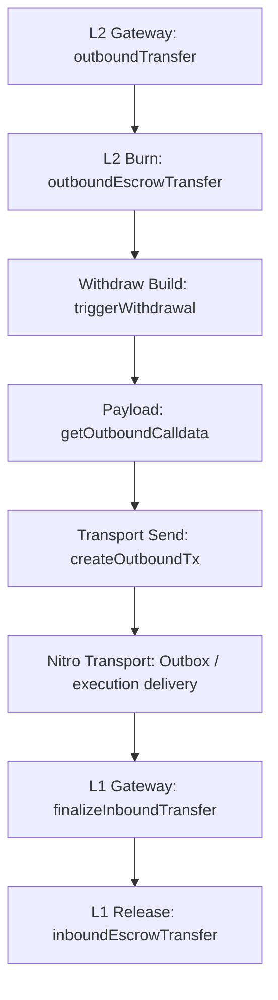

# Withdraw Review

## Flow



`Outbox / execution delivery` здесь отмечен только как transport segment полного withdraw path. Nitro execution internals не входят в мой текущий review scope.

## 1. L2ArbitrumGateway.outboundTransfer(...)

```solidity
function outboundTransfer(
    address _l1Token,
    address _to,
    uint256 _amount,
    uint256,
    uint256,
    bytes calldata _data
) public payable virtual override returns (bytes memory res) {
    require(msg.value == 0, "NO_VALUE");

    address _from;
    bytes memory _extraData;
    {
        if (isRouter(msg.sender)) {
            (_from, _extraData) = GatewayMessageHandler.parseFromRouterToGateway(_data);
        } else {
            _from = msg.sender;
            _extraData = _data;
        }
    }
    require(_extraData.length == 0, "EXTRA_DATA_DISABLED");

    uint256 id;
    {
        address l2Token = calculateL2TokenAddress(_l1Token);
        require(l2Token.isContract(), "TOKEN_NOT_DEPLOYED");
        require(_isValidTokenAddress(_l1Token, l2Token), "NOT_EXPECTED_L1_TOKEN");

        _amount = outboundEscrowTransfer(l2Token, _from, _amount);
        id = triggerWithdrawal(_l1Token, _from, _to, _amount, _extraData);
    }
    return abi.encode(id);
}
```

Что делает:

- начинает L2 -> L1 withdraw path
- определяет реального `_from`
- проверяет expected L1/L2 token pair
- запускает burn
- инициирует L2 -> L1 withdrawal message

Invariants:

- normal withdraw path не должен принимать `msg.value`
- router path и direct path должны детерминированно определить `_from` и `_extraData`
- withdraw должен идти только через корректную deployed L2 representation ожидаемого L1 token
- source-side accounting должен завершиться до creation of withdrawal message

## 2. L2ArbitrumGateway.outboundEscrowTransfer(...)

```solidity
function outboundEscrowTransfer(
    address _l2Token,
    address _from,
    uint256 _amount
) internal virtual returns (uint256 amountBurnt) {
    IArbToken(_l2Token).bridgeBurn(_from, _amount);
    return _amount;
}
```

Что делает:

- выполняет source-side burn L2 representation

Invariants:

- withdraw accounting на L2 должен происходить через burn соответствующего L2 token
- дальше по flow должен идти именно burnt amount

## 3. L2ArbitrumGateway.triggerWithdrawal(...)

```solidity
function triggerWithdrawal(
    address _l1Token,
    address _from,
    address _to,
    uint256 _amount,
    bytes memory _data
) internal returns (uint256) {
    uint256 currExitNum = exitNum;
    uint256 id = createOutboundTx(
        _from,
        _amount,
        getOutboundCalldata(_l1Token, _from, _to, _amount, _data)
    );
    emit WithdrawalInitiated(_l1Token, _from, _to, id, currExitNum, _amount);
    return id;
}
```

Что делает:

- связывает payload construction с transport-side tx creation
- эмитит `WithdrawalInitiated`

Invariants:

- current withdrawal должен получить `id` именно от transport-side creation path
- current `currExitNum` должен относиться именно к текущему initiated withdrawal

## 4. L2ArbitrumGateway.getOutboundCalldata(...)

```solidity
function getOutboundCalldata(
    address _token,
    address _from,
    address _to,
    uint256 _amount,
    bytes memory _data
) public view override returns (bytes memory outboundCalldata) {
    outboundCalldata = abi.encodeWithSelector(
        ITokenGateway.finalizeInboundTransfer.selector,
        _token,
        _from,
        _to,
        _amount,
        GatewayMessageHandler.encodeFromL2GatewayMsg(exitNum, _data)
    );

    return outboundCalldata;
}
```

Что делает:

- строит payload для future L1 finalize
- включает `token/sender/recipient/amount` semantics и текущий `exitNum`

Invariants:

- outbound payload должен target'ить именно `finalizeInboundTransfer`
- payload должен сохранять `_token / _from / _to / _amount` semantics без silent rewrite
- current `exitNum` должен включаться в payload до последующего transport-side increment

## 5. L2ArbitrumGateway.createOutboundTx(...)

```solidity
function createOutboundTx(
    address _from,
    uint256,
    bytes memory _outboundCalldata
) internal virtual returns (uint256) {
    exitNum++;
    return
        sendTxToL1(
            0,
            _from,
            counterpartGateway,
            _outboundCalldata
        );
}
```

Что делает:

- инкрементирует `exitNum` после inclusion into current payload
- отправляет L2 -> L1 message в `counterpartGateway`

Invariants:

- `exitNum` не должен инкрементироваться до inclusion into current payload
- transport-facing withdraw path должен target'ить именно `counterpartGateway`
- default withdraw message не должен нести L1 callvalue

## 6. L1ArbitrumGateway.finalizeInboundTransfer(...)

```solidity
function finalizeInboundTransfer(
    address _token,
    address _from,
    address _to,
    uint256 _amount,
    bytes calldata _data
) public payable virtual override onlyCounterpartGateway {
    (uint256 exitNum, bytes memory callHookData) = GatewayMessageHandler.parseToL1GatewayMsg(
        _data
    );

    if (callHookData.length != 0) {
        callHookData = bytes("");
    }

    (_to, ) = getExternalCall(exitNum, _to, callHookData);
    inboundEscrowTransfer(_token, _to, _amount);

    emit WithdrawalFinalized(_token, _from, _to, exitNum, _amount);
}
```

Что делает:

- принимает counterpart-gated L2 -> L1 finalize call
- парсит withdrawal payload
- резолвит final recipient
- выполняет final L1 release

Invariants:

- L1 finalize path должен вызываться только `counterpartGateway`
- final L1 release должен использовать уже post-resolution `_to`

## 7. L1ArbitrumGateway.inboundEscrowTransfer(...)

```solidity
function inboundEscrowTransfer(
    address _l1Token,
    address _dest,
    uint256 _amount
) internal virtual {
    IERC20(_l1Token).safeTransfer(_dest, _amount);
}
```

Что делает:

- выполняет final L1 release escrowed token получателю

Invariants:

- final release должен использовать именно validated `_l1Token`
- final release должен идти именно итоговому `_dest` и на `_amount`
