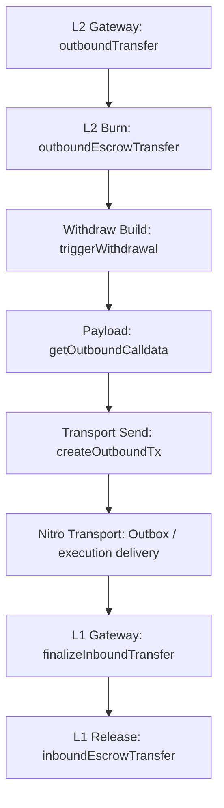

# Withdraw Review

## Flow

`Outbox / execution delivery` здесь отмечен только как transport segment полного withdraw path. Nitro execution internals не входят в мой текущий review scope.

## 1. L2ArbitrumGateway.outboundTransfer(...)

Что делает:

- начинает L2 -> L1 withdraw path
- определяет реального `_from`
- проверяет expected L1/L2 token pair
- запускает burn
- инициирует L2 -> L1 withdrawal message

Invariants:

- normal withdraw path не должен принимать `msg.value`
- router path и direct path должны детерминированно определить `_from` и `_extraData`
- withdraw должен идти только через корректную deployed L2 representation ожидаемого L1 token
- source-side accounting должен завершиться до creation of withdrawal message

## 2. L2ArbitrumGateway.outboundEscrowTransfer(...)

Что делает:

- выполняет source-side burn L2 representation

Invariants:

- withdraw accounting на L2 должен происходить через burn соответствующего L2 token
- дальше по flow должен идти именно burnt amount

## 3. L2ArbitrumGateway.triggerWithdrawal(...)

Что делает:

- связывает payload construction с transport-side tx creation
- эмитит `WithdrawalInitiated`

Invariants:

- current withdrawal должен получить `id` именно от transport-side creation path
- current `currExitNum` должен относиться именно к текущему initiated withdrawal

## 4. L2ArbitrumGateway.getOutboundCalldata(...)

Что делает:

- строит payload для future L1 finalize
- включает `token/sender/recipient/amount` semantics и текущий `exitNum`

Invariants:

- outbound payload должен target'ить именно `finalizeInboundTransfer`
- payload должен сохранять `_token / _from / _to / _amount` semantics без silent rewrite
- current `exitNum` должен включаться в payload до последующего transport-side increment

## 5. L2ArbitrumGateway.createOutboundTx(...)

Что делает:

- инкрементирует `exitNum` после inclusion into current payload
- отправляет L2 -> L1 message в `counterpartGateway`

Invariants:

- `exitNum` не должен инкрементироваться до inclusion into current payload
- transport-facing withdraw path должен target'ить именно `counterpartGateway`
- default withdraw message не должен нести L1 callvalue

## 6. L1ArbitrumGateway.finalizeInboundTransfer(...)

Что делает:

- принимает counterpart-gated L2 -> L1 finalize call
- парсит withdrawal payload
- резолвит final recipient
- выполняет final L1 release

Invariants:

- L1 finalize path должен вызываться только `counterpartGateway`
- final L1 release должен использовать уже post-resolution `_to`

## 7. L1ArbitrumGateway.inboundEscrowTransfer(...)

Что делает:

- выполняет final L1 release escrowed token получателю

Invariants:

- final release должен использовать именно validated `_l1Token`
- final release должен идти именно итоговому `_dest` и на `_amount`
